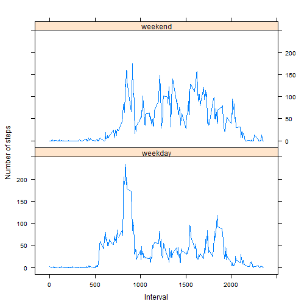

# Reproducible Research: Peer Assessment 1 


## Loading and preprocessing the data

First we load *lattice* library for graphics. Then
loading data from file "data/activity.csv"


```r
library(lattice)
datafile <- "data/activity.csv"
dt <- read.table(datafile, sep = ",", header = T)
```


No preprocessing used

## What is mean total number of steps taken per day?

 1. Calculate array  *steps.daily* for steps taken per day using *aggregate* function.  
 2. Then make histogramm with 30 bins for daily steps.  
 

```r
steps.daily <- aggregate(steps ~ date, data = dt, FUN = sum, na.action = na.omit)[, 
    2]

l <- min(steps.daily)
u <- max(steps.daily)
breaks = seq(l, u, length.out = 31)
histogram(steps.daily, breaks = breaks, col = "palegreen", xlab = "Interval", 
    ylab = "Number of steps", main = "Total number of steps taken each day")
```

 


Calulate mean and median of total number of steps taken per day.


```r
# daily.mean
mean(steps.daily)
```

```
## [1] 10766
```

```r
# daily.median
median(steps.daily)
```

```
## [1] 10765
```


## What is the average daily activity pattern?

Using *aggregate* function again we calculate average number of steps for earch
interval averaged across all days.  
After that making a plot for daily average activity.


```r

steps.average = aggregate(steps ~ interval, data = dt, FUN = mean)


xyplot(steps ~ interval, steps.average, type = "l", xlab = "Interval", ylab = "Number of steps", 
    main = "Number of steps averaged across all days")
```

 


Find the interval contains the maximum number of steps averaged.


```r
ind <- which(steps.average[, 2] == max(steps.average[, 2]))
steps.average[ind, 1]
```

```
## [1] 835
```


## Imputing missing values

 First, calculate the total number of missing values in the dataset
 
 

```r
# number of missing values
sum(sapply(dt$steps, is.na))
```

```
## [1] 2304
```


#### Filling Strategy:
For filling missing values we will use **the mean for each 5-minute interval**.
  
 1. First we define matrix with two rows: means for earch interval and 
number of steps for this interval from dataset.  
 2. Then we define function *na2mean*, which takes two dimentional vector. 
Funtions works in following way. If second dimention is defined then return
it's value. If second dimention of vector is NA then return first coordinate 
of vector.
 3. Then use *apply* function with our matrix and *na2mean*  function.

As a result we obtain vector  with filled NA positions with means.
Out last step is  to put this vector  into dataset instead of existing column 'steps' with 'NA'.


```r
steps2 <- cbind(steps.average = steps.average[, 2], steps <- dt[, 1])
#'na to mean' function
na2mean <- function(x) {
    if (is.na(x[2])) 
        (x[1]) else (x[2])
}
steps.new <- apply(steps2, 1, na2mean)
dt.new <- data.frame(steps = steps.new, dt[, 2:3])
```

Make the same histogramm as in step 1 with 30 bins for number of steps taken per day.
The only differense is using the data with filled 'NA'.

```r
steps.daily <- aggregate(steps ~ date, data = dt.new, FUN = sum)[, 2]
l <- min(steps.daily)
u <- max(steps.daily)
breaks = seq(l, u, length.out = 31)
histogram(steps.daily, breaks = breaks, col = "palegreen", xlab = "Interval", 
    ylab = "Number of steps", main = "Total number of steps taken each day, no missing values")
```

 

Calulate mean and median of total number of steps taken per day without 'NA'

```r
# daily.mean with filled 'NA'
mean(steps.daily)
```

```
## [1] 10766
```

```r
# daily.median with filled 'NA'
median(steps.daily)
```

```
## [1] 10766
```


There is a small difference between two medians. The means are identical.
Histogram with filled 'NA' looks a bit more simmetric with a bit high values in the center area.

## Are there differences in activity patterns between weekdays and weekends?

We define new  variable in the dataset with two levels - “weekday” and “weekend” 
in such way:  
 1. translate 'date' column into 'data and time' format and get weekday numbers
 for earch day from 0 ("Sunday")  up to 6="Saturday".
 2. If weekday number is in one of the {1,2,3,4,5} we define it as "weekday", else as "weekend"
 3. Add new columnt into data.frame
 4. Calculate new data.frame with columns: interval, average steps, weekday
 5. Make a panel plot containing a time series plot of the 5-minute interval (x-axis) and the average number of steps taken, averaged across all weekday days or weekend days (y-axis).  

```r
wd <- strptime(dt.new$date, "%Y-%m-%d")$wda
wd <- sapply(wd, function(x) {
    if (x %in% 1:5) 
        "weekday" else "weekend"
})
dt.new <- data.frame(dt.new, wd)

steps.average = aggregate(steps ~ wd + interval, data = dt, FUN = mean)

xyplot(steps ~ interval | wd, data = steps.average, layout = c(1, 2), type = "l", 
    ylab = "Number of steps", xlab = "Interval")
```

 


This plot shows us people walk more in weekends and less in weekdays.   
